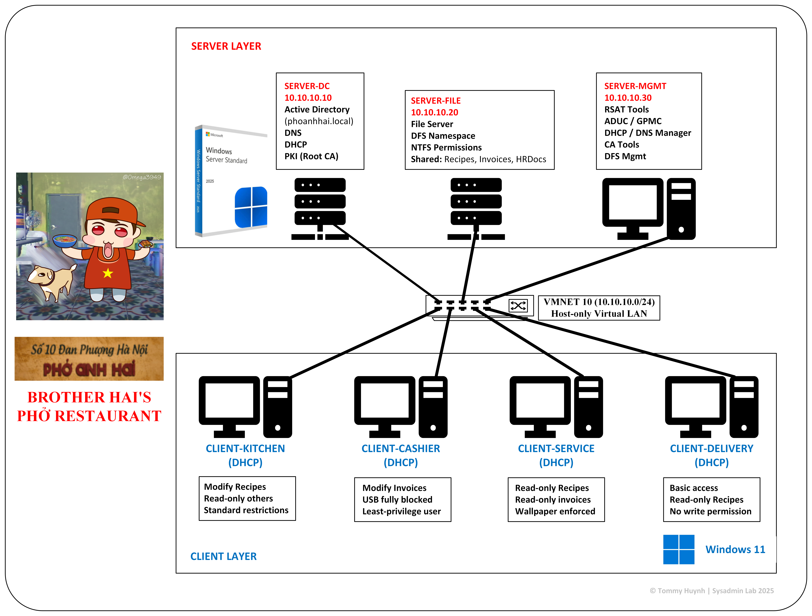

# 🍜 Pho Anh Hai – Windows Sysadmin Infrastructure Lab  
**Inspired by the Vietnamese indie horror game _Brother Hai’s Pho Restaurant_**  
This project builds a full Windows Server enterprise environment for a fictional restaurant company: **Pho Anh Hai Co. Ltd**.  
The lab uses VMware Workstation, Windows Server 2025, and Windows 11.

The goal:  
✔ Learn real System Administration  
✔ Practice Active Directory, DNS, DHCP, GPO, DFS, PKI  
✔ Build a professional portfolio project  
✔ Simulate the IT system of a small restaurant chain

✨ All configuration steps, screenshots, and topology diagrams are included below.

# Network Topology



---

# 1. 📡 Network Setup

### VMware Network Configuration  
All VMs use **VMnet10 – Host-only**  
- Subnet: `10.10.10.0/24`  
- DHCP from VMware: **disabled**  
- DHCP managed by SERVER-DC  

**Screenshot:**  


---

# 2. 🏢 Server Overview

| Server Name | Function | IP |
|-------------|----------|----|
| **SERVER-DC** | Domain Controller, DNS, DHCP, PKI | 10.10.10.10 |
| **SERVER-FILE** | File Server + DFS Namespace | 10.10.10.20 |
| **SERVER-MGMT** | Admin Tools (RSAT, GPO, ADUC) | 10.10.10.30 |

**Screenshot – All servers running:**  


---

# 3. 🧱 SERVER-DC Setup  
Domain Controller + DNS + DHCP + PKI

## 3.1 Rename PC → SERVER-DC  


## 3.2 Static IP Configuration  
IP: `10.10.10.10`  
DNS: `10.10.10.10`  


## 3.3 Install AD DS  
Server Manager → Add Roles → **Active Directory Domain Services**  


## 3.4 Promote to Domain Controller  
Domain: `phoanhhai.local`  


## 3.5 Install DHCP  


## 3.6 Create DHCP Scope  
Range: `10.10.10.100–10.10.10.200`  
DNS Option: `10.10.10.10`  


## 3.7 Install PKI (Certification Authority)  
Enterprise Root CA  


---

# 4. 🗂️ Active Directory Structure  
OU: **Pho Anh Hai Co. Ltd**  
Sub-OUs: Kitchen, Cashier, Service Staff, Delivery, Management, Servers, Groups  

**Screenshot:**  


## 4.1 Security Groups  
- GG_Kitchen  
- GG_Cashier  
- GG_ServiceStaff  
- GG_Delivery  
- GG_Management  


## 4.2 Department Users  
Example:  
- kitchen.user  
- cashier.user  
- service.user  
- delivery.user  
- manager.user  


---

# 5. 📁 SERVER-FILE Setup (DFS + NTFS)

## 5.1 Rename to SERVER-FILE & join domain  


## 5.2 Create Shared Folders  
```
E:\Shares\Recipes
E:\Shares\Invoices
E:\Shares\HRDocs
```


## 5.3 Share & NTFS Permissions  
### Recipes  
- GG_Kitchen → Modify  
- GG_Management → Modify  
- GG_ServiceStaff → Read  


### Invoices  
- GG_Cashier → Modify  
- GG_Management → Modify  


### HRDocs  
- GG_Management → Full Control  


## 5.4 DFS Namespace  
Namespace path:

``` \\phoanhhai.local\CompanyData ```

**Screenshot:**  


---

# 6. 🛠️ SERVER-MGMT Setup (Admin Tools)

## 6.1 Rename + Join Domain  


## 6.2 Install Admin Tools (RSAT)  
Installed tools:
- Active Directory Users and Computers  
- Group Policy Management  
- DNS Manager  
- DHCP Manager  
- Certificate Authority Tools  
- DFS Management Tool  

**Screenshot:**  


---

# 7. 🧑‍💻 Client Setup  

All Windows 11 clients use **DHCP**.

**Clients:**
- CLIENT-KITCHEN  
- CLIENT-CASHIER  
- CLIENT-SERVICE  
- CLIENT-DELIVERY  

## 7.1 DHCP Lease Confirmation  


## 7.2 Join Domain & Move to Correct OU  


---

# 8. 🔐 Group Policy (GPO)

## 8.1 Password Policy (Domain Level)  


## 8.2 Desktop Wallpaper (Branding)  


## 8.3 USB Block for Cashier Department  
Applied only to **OU: Cashier**

Policies:
- Removable Disks: Deny read  
- Removable Disks: Deny write  
- Removable Disks: Deny execute  

**Screenshot:**  


---

# 9. 🔑 PKI – Certificate Auto-Enrollment

## 9.1 Auto-Enrollment GPO  


## 9.2 Client Certificate Received  


---

# 10. 🧪 Client Testing (Real Business Simulation)

## 10.1 CLIENT-KITCHEN  
- Can modify **Recipes**  
- Cannot access **Invoices**  

  


---

## 10.2 CLIENT-CASHIER  
- USB fully blocked  
- Can modify **Invoices**  

  


---

## 10.3 CLIENT-SERVICE  
- Recipes = Read-only  
- Wallpaper applied  

  


---

## 10.4 CLIENT-DELIVERY  
- Access **Recipes** (read only)  


---

# 11. 🎯 What This Project Demonstrates

This lab shows full Windows Sysadmin capabilities:

- Active Directory and OU design  
- DNS & DHCP administration  
- Group Policy enforcement  
- File Server with NTFS permissions  
- DFS namespace  
- Internal PKI & certificate auto-enrollment  
- Client configuration & department-based access control  
- USB security policy  
- Realistic enterprise documentation workflow  

---

# 12. ❤️ Inspiration  
This project is inspired by the Vietnamese indie horror game:
**_Brother Hai’s Pho Restaurant_**  
but implemented in a **fully professional IT infrastructure design**.

---

# 13. 📬 Contact  
Created by: **Tommy Huynh**  
Use this project for learning, portfolio work, and system administration practice.

